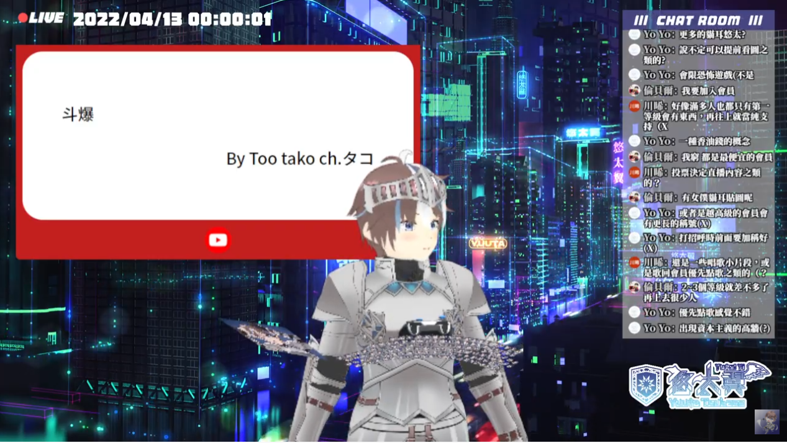
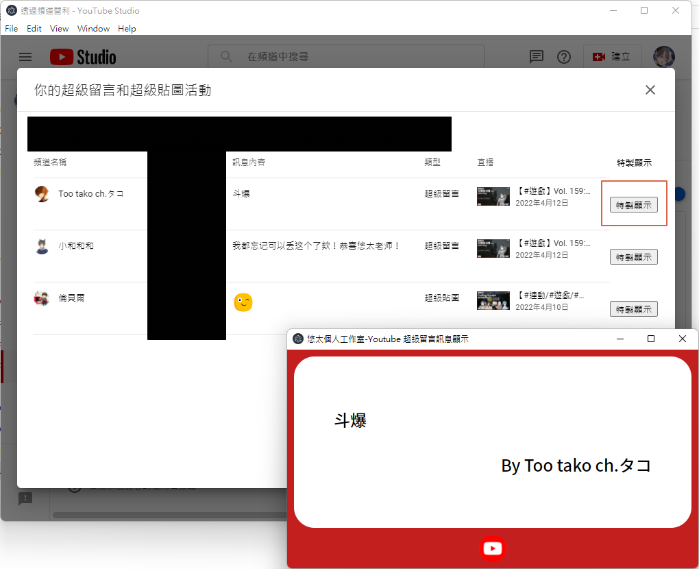

# Youtube 超級留言訊息實況小工具

一個可以用於實況中顯示Youtube 超級留言訊息的小工具。

## 下載頁面

可至[Release](https://github.com/YuutaTsubasa/youtube-superchat-message-tool/releases/)頁面根據自身的作業系統下載最新版本。

檔名 | 作業系統
--- | --- 
youtube-superchat-message-tool-win32-x64-{version}.zip | Windows (64-bit)
youtube-superchat-message-tool-{version}-1.x86_64.rpm | Linux (64-bit) .rpm
youtube-superchat-message-tool_{version}_amd64.deb | Linux (64-bit) .deb
youtube-superchat-message-tool-darwin-x64-{version}.zip | macOS (64-bit)

## 使用說明

可先參考綠界訊息實況小工具使用說明影片當作使用的參考：[http://yutaii.run/tool/1](http://yutaii.run/tool/1)

### 基本使用方法

1. 打開程式(youtube-superchat-message-tool.exe)，會打開兩個視窗：「網頁視窗」和「訊息視窗」。
2. 在「網頁視窗」登入 Youtube 後台。
3. 進入 Youtube 後台的營利中的「Supers」標籤。
4. 將詳細內容打開後，會看到表格後面每一條會多一個「特製顯示」的按鈕。
5. 按下去。
6. 於 OBS 介面擷取「訊息視窗」即可。（可利用濾鏡中的色度鍵去背景）

## 版本修正紀錄

### v1.0.4
- 修正簡體中文與日文無字型問題。

### v1.0.1
- 修正 '$' 之類的符號顯示的問題。

## 使用技術
- [npm](https://www.electronjs.org/)
- [Electron](https://www.electronjs.org/)
- [Electron Forge](https://www.electronforge.io/)
- [RxJS](https://rxjs.dev/)

## 作者
- [悠太翼 @YuutaTsubasa](http://yutaii.run/twitter)
- 歡迎訂閱我的 [Youtube 頻道](http://yutaii.run/youtube)！
- 有任何想要修改的部分歡迎發 Pull Request、發 Issue 或是私訊唷！
